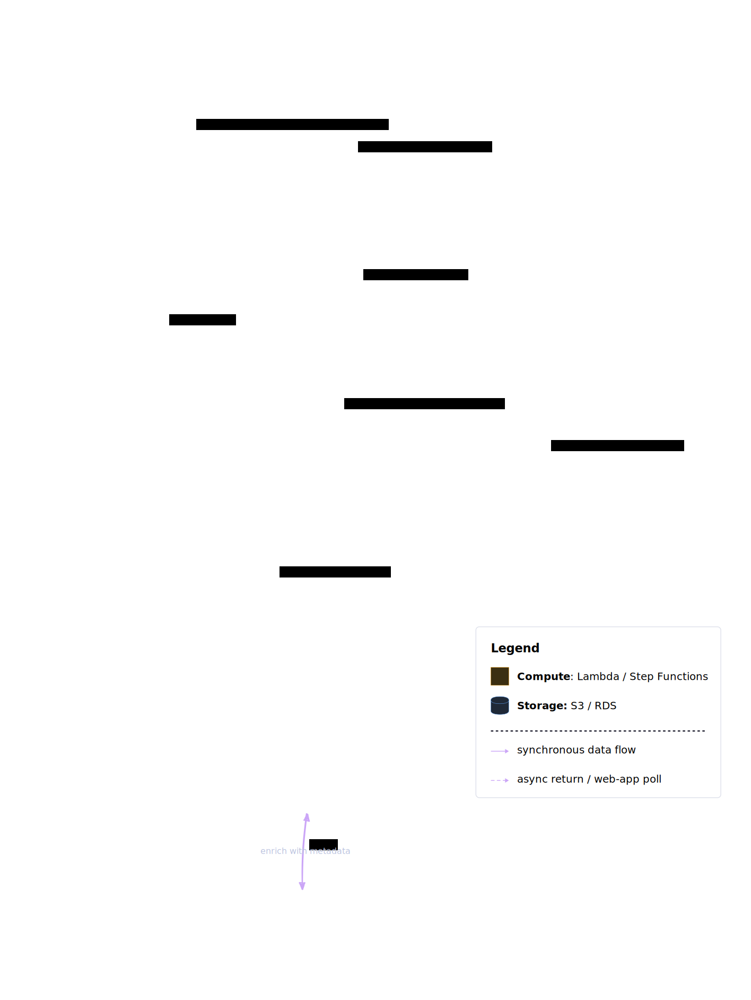

# PETadex Sequence Search

> **Note: This is an internal component, not a standalone tool. It is designed to be invoked as an AWS Lambda function by the PETadex web application.**

MMseqs2-powered protein sequence similarity search against 217M+ plastic-degrading enzyme sequences from the PETadex database. Packaged as a Docker container that runs as either an AWS Lambda function or a standalone CLI.

---

## How It Works (legacy single-Lambda MMseqs2 path)

1. On invocation, downloads the MMseqs2 sequence index from S3 (`s3://petadex/mmseqs2/`) — cached in `/tmp` across warm Lambda invocations
2. Runs `mmseqs easy-search` against the index
3. Uploads results as JSON to `s3://petadex/results/{sessionId}/{job_id}.json`
4. Returns the `job_id` to the caller; the web app fetches results from S3

This single-container path searches the ~1M-sequence `petadex-nr` subset and is **still the live path** served to the web app. It is being replaced by the DIAMOND scale-out architecture below, which searches the full ~307M Logan corpus.

---

## Architecture — DIAMOND scale-out search

The scale-out architecture replaces the single MMseqs2 Lambda with a **sharded, fan-out DIAMOND search** over the full Logan-scale protein corpus (**307,155,746 sequences**). The database is split into 20 shards, each searched in parallel by its own worker Lambda, with all shards resident on **S3** (not EFS). The web-app contract (event shape, result JSON, S3 keys) is preserved, so the cutover is a function-name swap on the caller's side.

> **Status:** live. The DIAMOND infra is deployed, the full 307M sharded DB is built and published (`diamond/LATEST`), and the web app was cut over to `petadex-diamond-orchestrator` (2026-06-03) — **users now search the Logan corpus, not nr.** The legacy MMseqs2 function remains deployed but no longer serves the web app (removal pending Phase 7).

### Why these choices

| Decision | Choice | Rationale |
|---|---|---|
| Engine | **DIAMOND2** (`blastp`, default sensitivity) | The Logan corpus was built with DIAMOND2 — methodological consistency. More compact DB format; streams better at scale. Parity with MMseqs2 validated at `--very-sensitive` (top-10 90–100% overlap, near-identical identities); the live search now runs default mode (recall-for-speed trade, 2026-06-04). |
| Storage | **S3, sharded** (not EFS) | At low query volume EFS costs ~$60/mo flat; the ~120 GB sharded DB on S3 is ~$2.80/mo. Per-cold-start shard download (~78s) is acceptable at BLAST-timescale latency. |
| Compute | **Lambda fan-out** | No idle cost; scales to N shards in parallel. |
| Coordination | **Step Functions Map** | Declarative per-shard retry/catch; a failed branch aborts the whole job (fail-fast). |
| Query distribution | **Inline in worker payload** | Orchestrator validates once and passes the FASTA in each worker invocation (well under Lambda's 256 KB limit) — no shared scratch. |
| Partial failures | **Fail-fast** | A partial corpus search is not reproducible; any shard failing (after retries) fails the whole job. Result schema unchanged. |

### Components

| Component | Function | Role |
|---|---|---|
| **Orchestrator** | `petadex-diamond-orchestrator` | Validates + parses FASTA once, resolves the DB version, reads the shard manifest, mints `jobId`, returns `{job_id, s3_key}` immediately, and starts the Step Functions execution. Never block-waits. |
| **State machine** | `petadex-diamond-search` (Step Functions) | A `Map` state fans out one worker per shard (`MaxConcurrency = SHARD_COUNT`). Per-branch retry on transient `Lambda.*` errors; `Catch: States.ALL` → fail-fast. Final state invokes the aggregator. |
| **Worker** (×20 in parallel) | `petadex-diamond-worker` | Downloads its assigned shard `.dmnd` to `/tmp` (cached across warm invocations, evicting any other shard first), runs `diamond blastp`, writes a raw outfmt-6 TSV part to S3. One worker per shard. |
| **Aggregator** | `petadex-diamond-aggregator` | Merges all parts → sorts by bitscore desc / evalue asc → top-K → enriches from RDS once → writes the final result JSON + `.index` pointer in the unchanged schema. |

All four share **one Docker image** (ARM64, DIAMOND built from source — no arm64 release binary exists); the Lambdas are distinguished by their `ImageConfig.Command` (`orchestrator.handler` / `worker.handler` / `aggregator.handler`). The legacy `mmseqs` binary remains in the image during the transition.

### Data flow



<!-- Diagram source: infra/architecture.d2 (D2). Regenerate with:
     d2 --theme 200 --sketch infra/architecture.d2 infra/architecture.svg -->


> **Fail-fast:** each Map branch retries transient `Lambda.*` errors; if any shard still fails, the whole execution fails (`Catch: States.ALL`) — no result JSON or `.index` is written, so the poller simply never sees a completion.

**Temporal view** — note the orchestrator returns *before* the search runs; the aggregator publishes the result minutes later, and the web app bridges the gap by polling:


### Sharded database on S3

The corpus FASTA (`s3://petadex/logan/petadex.catalytic_orfs.v1.1.fa`) is streamed and split round-robin into 20 shards; each is built with `diamond makedb` into a `.dmnd` and uploaded. Built offline by `scripts/build_diamond_shards.py` (an arm64 box with ~300 GB scratch — not a laptop job).

```
s3://petadex/diamond/
├── LATEST                                    # text pointer → current version dir
└── {version}/                                # e.g. catalytic_orfs_v1.1_20260602_222538
    ├── manifest.json                         # version, corpus, shard_count, per-shard key/sequences/bytes
    ├── shard_00.dmnd   (~5.6 GiB)            # 20 shards, ~15.36M sequences each
    ├── shard_01.dmnd
    ├── ...
    └── shard_19.dmnd
```

**Atomic versioning** (prevents mid-rebuild races): write all shards → write `manifest.json` → **then** update `LATEST`. The orchestrator reads `LATEST` once per job and passes the resolved version into the execution, so all workers pin to one version even if `LATEST` flips mid-job.

### Key runtime parameters

| Parameter | Value | Notes |
|---|---|---|
| Corpus size | 307,155,746 sequences | full Logan catalytic-ORF corpus |
| Total `.dmnd` | ~112 GiB / 120 GB | 20 shards, ~5.6 GiB each |
| `SHARD_COUNT` | **20** | bounded by `/tmp` (a shard must fit in 10 GB with headroom) |
| Worker memory | **10240 MB** (Lambda max, ≈6 vCPU) | DIAMOND search is CPU-bound; vCPU count sets search wall time |
| Worker `/tmp` | **10240 MB** | holds one ~6 GB shard + query + output |
| Worker timeout | **600 s** | ~78 s download + search ≈ ~290 s/shard at `--very-sensitive`, with headroom; default mode is faster, so the headroom only grows |
| Worker reserved concurrency | **100** | 20 workers per search ⇒ caps at ~5 concurrent searches; must exceed peak burst (3 jobs × 20 = 60), not equal it |
| Sensitivity | **default** (no flag) | recall-for-speed trade chosen 2026-06-04 over the Phase-0 `--very-sensitive` lock (~34 s vs ~170 s per shard). Env `DIAMOND_SENSITIVITY` overrides (empty/`default`/`none` ⇒ no flag). Re-validate parity if distant homologs matter. |
| `-b` (block size) | **1** | bounds RAM, not disk |
| Per-shard timing | download ~78 s, search ~190 s, total ~290 s (measured at `--very-sensitive`) | job wall ~5 min; default mode reduces search time |

### Warm cache, cold starts & the download lever

**The ~78 s shard download dominates the ~37 s search — it is the single biggest latency lever, and it is largely unavoidable at current query volume.** Each worker caches its `.dmnd` in `/tmp` and reuses it across warm invocations, but that cache only pays off when a warm container is handed the *same* shard again:

- A `.dmnd` shard is ~6 GB and `/tmp` is 10 GB, so **only one shard fits at a time.** Before downloading, the worker evicts any other cached shard (otherwise a second 6 GB download overflows `/tmp` with `No space left on device`).
- Lambda warm-container routing is **not shard-affine** (Hard Constraint #5) — there is no guarantee that the container holding shard *N* is the one invoked for shard *N* next time. A warm container handed a different shard evicts and re-downloads.
- At low query volume, containers rarely stay warm between searches anyway, so **nearly every search is effectively cold**: ~20 parallel cold downloads of ~78 s each. The design assumes this ("plan for cold-dominated economics") — it is why S3 was chosen over EFS, and why end-to-end latency is ~5 min, not ~40 s.

The ~78 s/shard download is the **Lambda per-function network ceiling** (~78 MB/s) at this object size, not a connection-pool or tuning issue (investigated — a pool fix changed nothing). So the download can't be meaningfully sped *per worker*; reducing it means changing the storage/caching model. The documented reopen levers, **only worth pulling if query volume rises** (otherwise the flat cost isn't justified):

- **EFS or a small persistent instance** — shards resident on a shared mount, no per-query download. ~$60/mo flat vs ~$2.80/mo for S3; this is the explicit S3-vs-EFS reopen condition.
- **Provisioned/warm pool with shard affinity** — keep N warm containers, each pinned to a shard. Hard because Lambda doesn't expose affinity; would need careful routing.
- **More, smaller shards** — smaller `.dmnd` per worker downloads faster in parallel, lowering wall time, at the cost of more invocations per search. The `/tmp` ceiling permits as few as ~15 shards but allows going higher.

Until volume justifies one of these, the download cost is accepted by design. If it stops being acceptable, EFS is the first lever to pull.

### Result S3 layout & contract

The **contract is unchanged** from the legacy path, so the web app needs only a function-name swap:

```
results/{sessionId}.index                          # 36-byte pointer: the jobId
results/{sessionId}/{jobId}.json                   # final result (schema below)
results/{sessionId}/{jobId}/parts/shard_N.tsv      # raw worker outputs (aggregator input)
results/{sessionId}/{jobId}/parts/shard_N.meta.json# per-shard timing sidecar
results/{sessionId}/{jobId}/timing.json            # job-level timing rollup
```

The result JSON keeps `{ query_header, query_sequence, query_length, num_results, results[] }` (each hit: `target_id, query_start, query_end, target_start, target_end, alignment_length, percent_identity, evalue, bitscore, metadata`), plus **additive identity stamps** the web app may ignore or render: `engine` (`diamond`), `database`, `database_version`, `db_sequence_count`. Note Logan target IDs are ORF IDs (not GenBank accessions), so `metadata` is typically `null` for Logan hits.

Two JSON objects are written per job: the **search result** (`{jobId}.json`) and a separate **timing diagnostic** rollup (`{jobId}/timing.json`). Both schemas are below.

#### Result JSON schema (`results/{sessionId}/{jobId}.json`)

**Top-level (job metadata):**

| Field | Type | Description |
|---|---|---|
| `query_header` | string | User-supplied label identifying the search (free text; defaults to `query`). |
| `query_sequence` | string | The input amino-acid sequence that was searched. |
| `query_length` | int | Length of the query in residues. |
| `num_results` | int | Number of hits returned (equals `len(results)`). |
| `engine` | string | Search engine — always `diamond` on this path. |
| `database` | string | S3 path of the source corpus FASTA the shards were built from (`s3://petadex/logan/petadex.catalytic_orfs.v1.1.fa`). |
| `database_version` | string | Versioned build tag of the corpus (e.g. `catalytic_orfs_v1.1_20260602_222538`). Pins the result to a specific corpus build. |
| `db_sequence_count` | int | **Sequence** count across all shards (307,155,746). This is the corpus size for reference — it is *not* the e-value `--dbsize`, which is the residue count (see Scoring & e-values). |
| `results` | array | Hit list, ranked by bit-score descending, then e-value ascending. |

**Per-hit object (each element of `results`):**

| Field | Type | Description |
|---|---|---|
| `target_id` | string | Identifier of the matched DB sequence — Logan's native FASTA header, passed through unchanged. Pipe-delimited; see format below. |
| `query_start` | int | Alignment start on the query (1-based, inclusive). |
| `query_end` | int | Alignment end on the query (1-based, inclusive). |
| `target_start` | int | Alignment start on the target (1-based, inclusive). |
| `target_end` | int | Alignment end on the target (1-based, inclusive). |
| `alignment_length` | int | Length of the aligned region in residues. |
| `percent_identity` | float | Percent identical residues over the alignment, **0–100** (DIAMOND's native scale; never re-scaled — see Scoring & e-values). |
| `evalue` | float | Expectation value, calibrated against the **full corpus** (not the local shard) via `--dbsize`. |
| `bitscore` | float | DIAMOND bit-score. **Primary ranking key.** |
| `metadata` | object \| null | RDS-enriched annotation; `null` when the target has no RDS match (the usual case for Logan ORF IDs — see below). |

Coordinates follow DIAMOND's outfmt-6 default: **1-based, inclusive** on both query and target.

**`target_id` format.** The build script (`scripts/build_diamond_shards.py`) keeps each record's **native corpus header** verbatim as the sequence ID — it does *not* synthesize or define this convention, which originates upstream in the Logan catalytic-ORF corpus. Observed IDs are pipe-delimited with **7 fields**, falling into two provenance types:

| Field | Reference/structural hit | Logan metagenomic hit |
|---|---|---|
| | `1\|WP_054022242.1\|\|\|\|\|` · `4065673\|6EQD_A\|\|\|\|\|` | `610376058\|\|SRR15056541\|5882\|0\|933\|3` |
| 1 | numeric ID (always present) | numeric ID (always present) |
| 2 | reference accession — GenBank protein (`WP_054022242.1`) or PDB (`6EQD_A`) | *(empty)* |
| 3 | *(empty)* | SRA run accession (`SRR…`/`ERR…`) |
| 4–7 | *(empty)* | numeric metagenomic coordinates (contig/ORF locus, start, end, frame/strand) |

> ⚠️ Fields 4–7 are **not authoritatively defined in this repo** — the build script is a passthrough, so their exact meaning must be confirmed against the upstream Logan corpus specification before relying on them. Consumers should treat the whole `target_id` as an opaque key and split it only for display.

**`metadata` when populated.** Enrichment joins `blast_nr_metadata` on `genbank_accession_id`. Logan ORF IDs are not GenBank accessions, so they don't match and `metadata` is `null` for essentially all Logan hits (this is expected, not a failure). When a target *does* match (e.g. a reference/nr accession), `metadata` is an object with: `genbank_accession_id`, `organism`, `protein_id`, `definition`, `taxonomy`, `journal`, `collection_date`, `country` (all strings, individually nullable).

#### Timing diagnostic schema (`results/{sessionId}/{jobId}/timing.json`)

A side-car rollup written **beside** the result (not inside it), so it survives the fail-fast path and needs no contract change.

**Top-level:**

| Field | Type | Description |
|---|---|---|
| `job_id` | string (uuid) | Unique search job identifier. |
| `session_id` | string | Session/run label (e.g. `regen_example_fast_petase`). |
| `version` | string | Corpus build version (matches `database_version`). |
| `status` | string | `success` or `failed`. |
| `submitted_at` | string (ISO 8601) | Job submission timestamp (start of the wall clock). |
| `completed_at` | string (ISO 8601) | Rollup-write timestamp. |
| `total_wall_ms` | float \| null | End-to-end wall time from `submitted_at`, in ms. |
| `shard_count` | int | Number of shards the corpus is split into (20). |
| `shards_expected` | int | Shards the job expected to report. |
| `shards_completed` | int | Shards that completed successfully. Equality with `shards_expected` is the fail-fast completeness check. |
| `slowest_shard_ms` | float \| null | Max per-shard `total_ms` (≈ `total_wall_ms`). |
| `fastest_slowest_spread_ms` | float \| null | Spread between fastest and slowest shard — the load-balance metric. |
| `orchestrator` | object \| null | Orchestrator pre-start phase timings (`parse_ms`, `resolve_version_ms`, `load_shards_ms`, `total_pre_start_ms`). |
| `aggregator` | object \| null | Aggregator post-Map phase timings (below); `null` on the failure path. |
| `shards` | array | Per-shard timing records, sorted by `shard_index`. |

**`aggregator` object:**

| Field | Type | Description |
|---|---|---|
| `read_parts_ms` | float | Time reading + parsing all shard parts from S3. |
| `sort_ms` | float | Time for the global bitscore/evalue ranking + top-K. |
| `metadata_ms` | float | Time for the RDS metadata enrichment round-trip. |
| `write_result_ms` | float | Time writing the combined result + `.index` to S3. |
| `total_ms` | float | Sum of the aggregator phases. |

**Per-shard object (each element of `shards`):**

| Field | Type | Description |
|---|---|---|
| `shard_index` | int | Shard identifier (0–19). |
| `download_ms` | float | Time to download the shard `.dmnd` to `/tmp`. |
| `search_ms` | float | Time for `diamond blastp` on this shard. |
| `total_ms` | float | Download + search for this shard. |
| `shard_size_bytes` | int | Size of the shard `.dmnd` (~6.0 GB / ~5.6 GiB each). |
| `shard_seq_count` | int | Sequences in this shard (~15.36M each). |
| `num_hits` | int | Hits this shard contributed before the global merge. |
| `status` | string | Per-shard status (`success` / `failed` / `missing`). |
| `error` | string \| null | Error message if the shard failed; `null` on success. |
| `timestamp` | string (ISO 8601) | Shard completion time. |

A shard whose worker died before writing its sidecar appears as `{ "shard_index": i, "status": "missing" }` rather than being dropped.

**Notes from observed data.** Shards are near-perfectly even — every shard holds 15,357,787–15,357,788 sequences and ~6.017 GB, confirming the round-robin partition balances both seq count and residues (20 × ~15.357M = the 307,155,746 corpus total). Per-shard `download_ms` is uniform (~77–78 s, the Lambda network ceiling), so the `fastest_slowest_spread_ms` comes entirely from `search_ms`, which clusters into two bands (~29 s and ~37–38 s). The bimodality is not explained by sequence count (identical across shards) and is attributed to **Lambda vCPU allocation variance** (cold-vs-warm CPU) — a known, benign source of the ~9–10 s spread.

### Scoring & e-values

`percent_identity` (0–100), `bitscore`, and the alignment coordinates are taken straight from DIAMOND. Results are ranked by **bitscore** (tiebreak: e-value), which is correct across shards because a bit score depends only on the scoring system, not database size.

**E-values, however, scale with database size** — so a shard searched in isolation would report e-values calibrated against only ~1/20 of the corpus (≈20× too significant). To fix this, every worker is given `--dbsize <total corpus residues>` (the manifest's `total_letters`, threaded orchestrator → worker), so e-values are calibrated against the **full corpus** and match a single full-database search. Bit scores are unaffected. (Engineering detail in `docs/evalue-calibration.md`; if a manifest lacks `total_letters`, workers omit `--dbsize` and fall back to per-shard e-values.)

### Telemetry

Each worker writes a standalone `shard_N.meta.json` sidecar (download/search ms, shard size, hit count, status) from its `finally`, so even a failed shard leaves a breadcrumb. The aggregator rolls these into `timing.json` (total wall, slowest shard, per-shard array). Telemetry lives **beside** the result, not inside it, so it survives the fail-fast path and needs no contract change.

### Failure policy (fail-fast)

If any shard fails after the Step Functions per-branch retries, the **whole job fails** — no partial results, no `incomplete` flag, schema unchanged. A failed job writes a `timing.json` with `status: "failed"` and per-shard `error` fields, but **no result JSON / `.index`** — so a poller sees the search simply never complete (the caller should apply its own timeout).

### Cutover (done — 2026-06-03)

The web app's search invocation was repointed from `petadex-mmseqs2-search` to **`petadex-diamond-orchestrator`** (its role granted `lambda:InvokeFunction` on the orchestrator). Because the contract is preserved, no result-parsing changes were needed; latency rose from ~58 s to ~5 min, so the caller applies a poll timeout / failure state. Remaining cleanup (remove MMseqs2 from the image / `mmseqs2/` prefix) is tracked under Phase 7.

---

## Project Structure

```
petadex-sequence-search/
├── lambda_function.py          # Lambda handler (search + history actions)
├── cli.py                      # CLI entrypoint (outputs JSON to stdout)
├── Dockerfile                  # ARM64 Lambda image with MMseqs2
├── requirements.txt
├── scripts/
│   ├── update_sequence_index.py  # Rebuilds MMseqs2 index from PostgreSQL
│   ├── setup_s3_access.sh        # S3 bucket/IAM setup helper
│   ├── .env.example
│   └── README.md
└── .github/workflows/
    ├── deploy.yml                # Auto-deploy to Lambda on push to main
    ├── docker-publish.yml        # Publish image to Docker Hub on tag
    └── update-database.yml.example
```

---

## Lambda API

The Lambda function accepts two actions via the event body.

**Search:**
```json
{
  "action": "search",
  "sessionId": "abc123",
  "sequence": "MKLLIVLLAACLAVFAAAEPQIAVV",
  "max_results": 50
}
```

Response:
```json
{
  "job_id": "550e8400-e29b-41d4-a716-446655440000",
  "s3_key": "results/abc123/550e8400-e29b-41d4-a716-446655440000.json"
}
```

**History:**
```json
{
  "action": "history",
  "sessionId": "abc123"
}
```

Response:
```json
{
  "history": [
    { "job_id": "...", "s3_key": "...", "last_modified": "...", "size": 1234 }
  ]
}
```

---

## Deployment

Pushes to `main` automatically build and deploy via GitHub Actions (`deploy.yml`):
1. Bumps the semver tag
2. Builds a `linux/arm64` Docker image and pushes to ECR (`petadex-mmseq2-search`)
3. Updates the Lambda function (`petadex-mmseqs2-search`) with the new image

Manual deploy:
```bash
export DOCKER_DEFAULT_PLATFORM=linux/arm64

aws ecr get-login-password --region us-east-1 | \
  docker login --username AWS --password-stdin \
  YOUR_ACCOUNT_ID.dkr.ecr.us-east-1.amazonaws.com

docker buildx build --platform linux/arm64 --provenance=false -t petadex-search .

docker tag petadex-search:latest \
  YOUR_ACCOUNT_ID.dkr.ecr.us-east-1.amazonaws.com/petadex-mmseq2-search:latest
docker push YOUR_ACCOUNT_ID.dkr.ecr.us-east-1.amazonaws.com/petadex-mmseq2-search:latest

aws lambda update-function-code \
  --function-name petadex-mmseqs2-search \
  --image-uri YOUR_ACCOUNT_ID.dkr.ecr.us-east-1.amazonaws.com/petadex-mmseq2-search:latest
```

---

## Local Testing

```bash
docker build -t petadex-search .

# Lambda mode
docker run -p 9000:8080 \
  -e AWS_ACCESS_KEY_ID=$AWS_ACCESS_KEY_ID \
  -e AWS_SECRET_ACCESS_KEY=$AWS_SECRET_ACCESS_KEY \
  petadex-search

curl -XPOST "http://localhost:9000/2015-03-31/functions/function/invocations" \
  -d '{"action":"search","sessionId":"test","sequence":"MKLLIVLLALAVAALHAQQGVGAPVP","max_results":10}'

# CLI mode (results to stdout, no S3 upload)
docker run --rm \
  -e AWS_ACCESS_KEY_ID=$AWS_ACCESS_KEY_ID \
  -e AWS_SECRET_ACCESS_KEY=$AWS_SECRET_ACCESS_KEY \
  --entrypoint python3 \
  petadex-search cli.py "MKLLIVLLALAVAALHAQQGVGAPVP" 10
```

---

## Database Updates

The MMseqs2 index is version-controlled via a `LATEST` pointer file in S3. To rebuild the index from the PETadex PostgreSQL database:

```bash
cp scripts/.env.example scripts/.env
# Fill in DB credentials

pip install -r scripts/requirements.txt
brew install mmseqs2

source scripts/.env
./scripts/update_sequence_index.py
```

This extracts sequences from the `enzyme_fastaa` table, builds a new timestamped MMseqs2 index, uploads it to `s3://petadex/mmseqs2/{version}/`, and updates the `LATEST` pointer. No Lambda redeployment needed — the next cold start picks up the new version automatically.

---

## Input Validation

- Valid amino acids: `ACDEFGHIKLMNPQRSTVWY`
- Minimum length: 10 amino acids
- Maximum length: 10,000 amino acids

---

## Tech Stack

- **Search**: DIAMOND2 `blastp` (scale-out, now serving the web app) · MMseqs2 `easy-search` (legacy single-Lambda, deployed but no longer serving; removal pending Phase 7)
- **Runtime**: Python 3.11 on AWS Lambda ARM64 (Graviton)
- **Coordination**: AWS Step Functions (`Map` fan-out) across orchestrator / worker / aggregator Lambdas
- **Storage**: Amazon S3 (`petadex` bucket) — sharded `.dmnd` database + results
- **Enrichment**: PETadex RDS (PostgreSQL) `blast_nr_metadata`
- **CI/CD**: GitHub Actions → ECR → Lambda
- **Database source**: full Logan catalytic-ORF corpus, 307M sequences (DIAMOND) · `enzyme_fastaa` ~1M nr subset (legacy MMseqs2)
